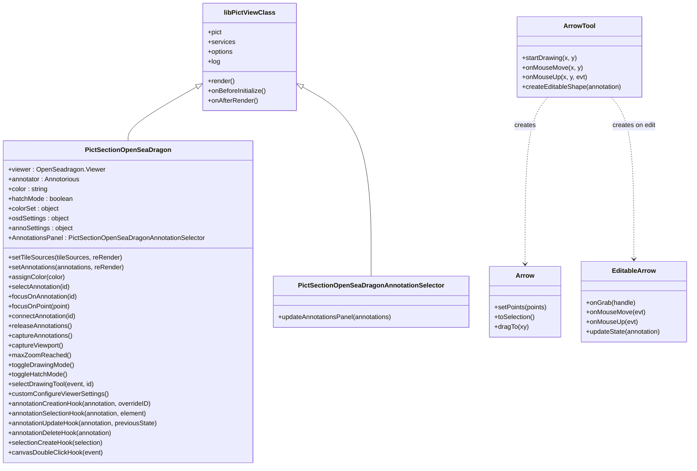

# Architecture

Pict Section OpenSeaDragon is built as a thin adapter between the [Pict](https://fable-retold.github.io/pict/) MVC framework and two external browser libraries: [OpenSeaDragon](https://openseadragon.github.io/) (deep-zoom image viewer) and [Annotorious](https://annotorious.github.io/) (W3C Web Annotation editor). The adapter lives in two `pict-view` subclasses and a bundle of custom Annotorious tools.

## Module Map

<!-- bespoke diagram: edit diagrams/module-map.mmd or .hints.json, then: npx pict-renderer-graph build modules/pict/pict-section-openseadragon/docs -->

## Class Hierarchy

## Rendering Lifecycle

<!-- bespoke diagram: edit diagrams/rendering-lifecycle.mmd or .hints.json, then: npx pict-renderer-graph build modules/pict/pict-section-openseadragon/docs -->

## Annotation Event Flow

<!-- bespoke diagram: edit diagrams/annotation-event-flow.mmd or .hints.json, then: npx pict-renderer-graph build modules/pict/pict-section-openseadragon/docs -->

## File Structure

<!-- bespoke diagram: edit diagrams/file-structure.mmd or .hints.json, then: npx pict-renderer-graph build modules/pict/pict-section-openseadragon/docs -->

## View State

`PictSectionOpenSeaDragon` keeps runtime state directly on the instance. These are the members you will see referenced from hooks and subclass overrides:

| Member | Type | Description |
|---|---|---|
| `this.viewer` | `OpenSeadragon.Viewer` | The live OpenSeaDragon viewer instance. |
| `this.annotator` | `Annotorious` | The live Annotorious instance (may be destroyed when annotation is disabled). |
| `this.color` | `string` | The active color key (one of `Object.keys(this.colorSet)`). |
| `this.colorSet` | `object` | The resolved `Colors` map from options. |
| `this.hatchMode` | `boolean` | Whether new annotations are drawn with the hatch fill pattern. |
| `this.editingEnabled` | `boolean` | `options.EnableAnnotation && toolbarElement` -- governs toolbar + event wiring. |
| `this.targetElement` | `HTMLElement` | The `#OpenSeaDragon-Element` div that OSD mounts into. |
| `this.toolbarElement` | `HTMLElement` | The `#DrawingToolbar` div that Annotorious mounts its toolbar into. |
| `this.osdSettings` | `object` | Fully-assembled settings object passed to `OpenSeadragon(...)`. |
| `this.annoSettings` | `object` | Fully-assembled settings object passed to `OpenSeadragon.Annotorious(...)`. |
| `this.format` | `function` | Annotorious format function that maps each annotation to its `pict-osd-<color>` CSS class. |
| `this.AnnotationsPanel` | `PictSectionOpenSeaDragonAnnotationSelector` | Reference to the registered sibling comments panel view, if any. |
| `this.triggerRender` | `boolean` | Internal flag used to request a deferred re-render of the companion panel. |

All of these are populated in `onAfterRender`. Override `customConfigureViewerSettings()` if you need to mutate `osdSettings` or `annoSettings` before OpenSeaDragon / Annotorious are instantiated.

## Color Pipeline

Colors drive both the UI and per-annotation stroke styling:

1. `options.Colors` -- the developer-provided `{ key: cssColor }` map.
2. On the `viewer`'s `open` event, the view generates a CSS block with `.pict-osd-<key>`, `.pict-osd-fill-<key>`, and `.pict-osd-<key>-hatched` rules and assigns it to `#ColorOverrides`.
3. For each color, a toolbar button is appended to `#ColorPickerToolbar` with an `onclick` that calls `assignColor(key)` on the registered view.
4. `this.format` is registered as an Annotorious formatter so every annotation element picks up `pict-osd-<key>` from its `target.styleClass`.
5. `annotationCreationHook` writes the active color (optionally suffixed with `-hatched`) into each new annotation's `target.styleClass` and embeds a stylesheet in `annotation.stylesheet`.

## Hatch Fill

When `toggleHatchMode()` flips `this.hatchMode` to `true`, new annotations are tagged with `<color>-hatched` instead of `<color>`. The view generates an SVG hatch pattern via `buildHatchPattern(color, bounds)` and inlines it as a `url('data:image/svg+xml;...#hatch')` fill value in the annotation's stylesheet. The pattern's scale is derived from the largest dimension of the current image so it renders consistently across zoom levels.
